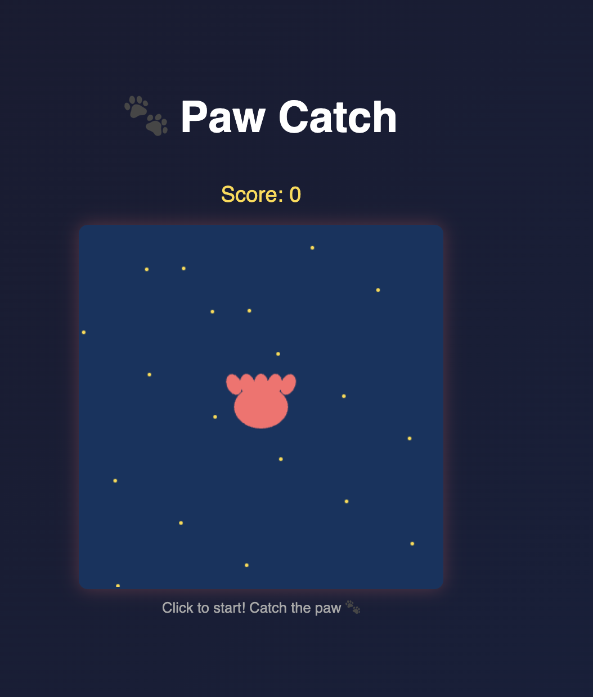

# Paw Game 🐾

A simple and fun clicking game built with HTML, CSS, and JavaScript.

## About

Paw Game is an engaging interactive clicking game where players test their reflexes by clicking on moving paws. Each successful click increases your score and speeds up the gameplay, creating an increasingly challenging experience. Perfect for quick gaming sessions and honing your clicking skills!

## How to Play

1. Open `index.html` in your browser
2. Click anywhere on the game canvas to start
3. Click on the moving paw 🐾 to score points!
4. The paw moves faster as your score increases

## Files

- `index.html` - Main game structure
- `style.css` - Game styling
- `game.js` - Game logic

## Live Demo

https://alfredang.github.io/paw-game/

## License

MIT
